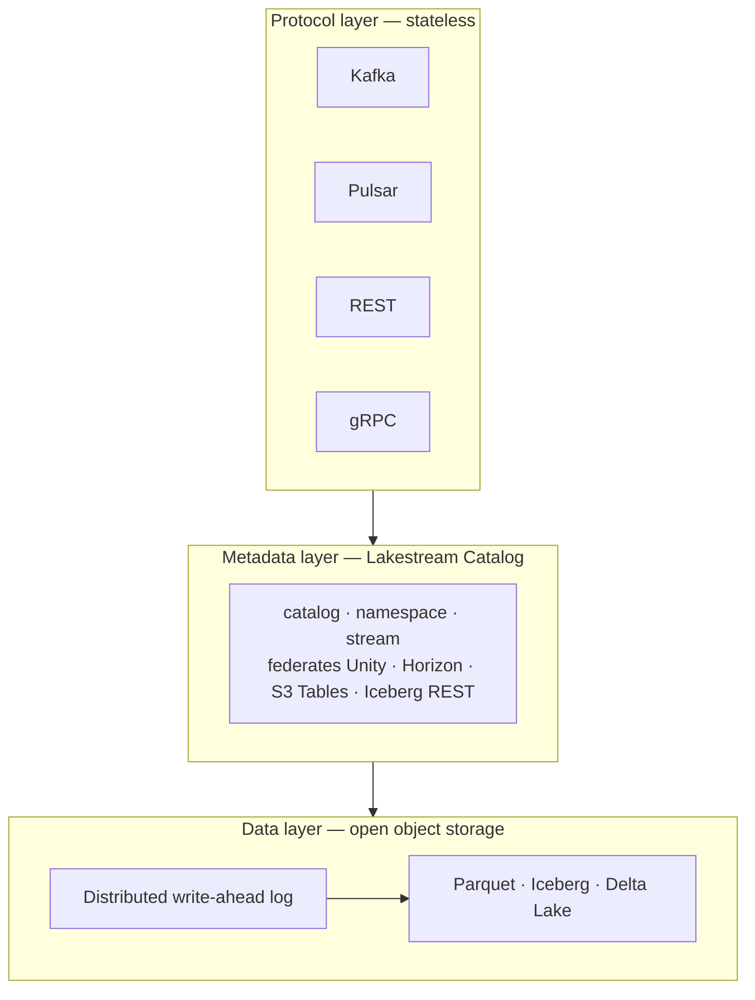

# Lakestream

**Streams as first-class lakehouse primitives**

Just as the lakehouse dissolved the boundary between data warehouses and data lakes, **Lakestream dissolves the boundary between data streaming and the lakehouse**. Topics become tables. Producers write once, in open formats, on object storage. Analytics, ML, and real-time applications all query the same data — without connectors, materialization jobs, or duplicated data copies.

## Core tenets

- **Stream–table duality.** Every stream is also a table, with offset monotonicity, eventual visibility, and schema consistency.
- **Zero-ETL by construction.** Data lands once in open formats on object storage — no connector jungle, no pipeline drift.
- **Leaderless & diskless.** Stateless servers, no partition rebalancing, no broker disks. Durability is delegated to object storage.
- **Multi-protocol.** Apache Kafka® and Apache Pulsar® serve the same streams simultaneously.
- **Open formats.** Parquet, Apache Iceberg®, and Delta Lake on object storage. Federated with Unity Catalog, Snowflake Horizon Catalog, AWS S3 Tables, and Iceberg REST Catalogs.
- **Cost-efficient.** Eliminating cross-AZ replication yields up to 95% cost reduction versus traditional leader-per-partition streaming.

## Architecture in three layers

**Data layer** — a distributed write-ahead log delivers real-time acknowledgment, then compacts into Parquet and lands in open table formats on object storage.

**Metadata layer** — a stream catalog federates with existing lakehouse catalogs, making streams discoverable alongside lakehouse tables.

**Protocol layer** — stateless servers speak Kafka, Pulsar, REST, and gRPC over the same data and catalog, simultaneously.

## What lives here

`lakestream-io` is the open community home for Lakestream. It is being bootstrapped: specifications, reference code, and examples will land here as they mature. The first working reference implementation of Lakestream — **Ursa for Kafka**, a native Apache Kafka® service built on Lakestream's architectural concepts — is documented in the post linked below.

If you're interested in the paradigm or plan to contribute, watch this org for the first repositories.

## Learn more

- [From Streams to Lakestreams — the paradigm](https://streamnative.io/blog/from-streams-to-lakestreams)
- [Ursa for Kafka — the reference implementation](https://streamnative.io/blog/ursa-for-kafka-native-apache-kafka-service-on-lakestream)

---

*Lakestream is stewarded by [StreamNative](https://streamnative.io).*

*Apache Kafka®, Apache Pulsar®, Apache Iceberg®, Apache Flink®, and Apache Polaris™ are trademarks of the Apache Software Foundation. Delta Lake is a project of the Linux Foundation. Unity Catalog is a trademark of Databricks, Inc. Snowflake Horizon Catalog is a trademark of Snowflake Inc. Amazon S3 is a trademark of Amazon.com, Inc. All other marks are the property of their respective owners.*
